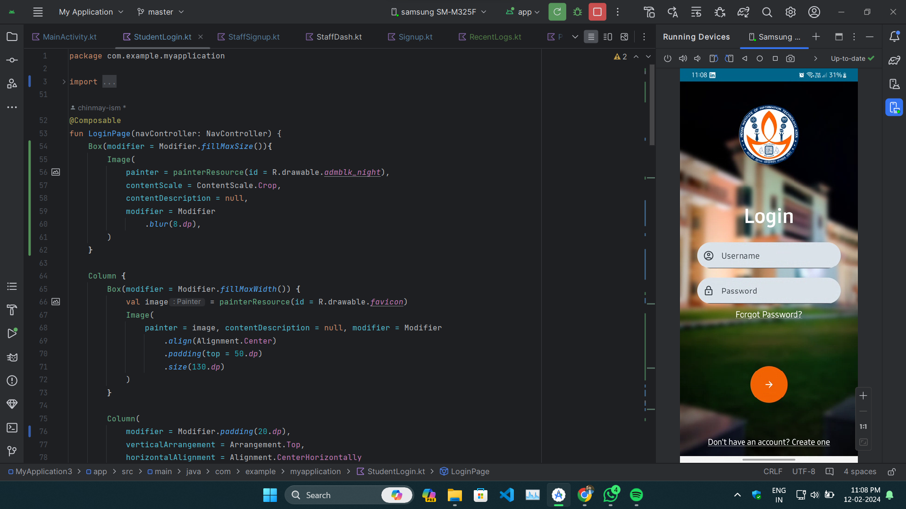
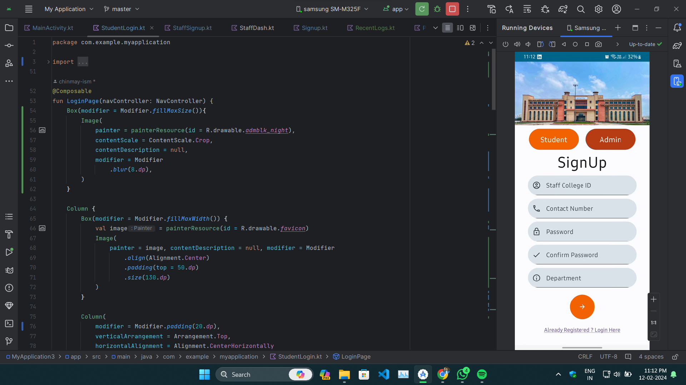
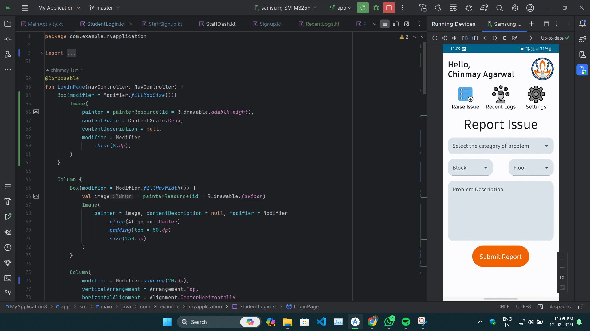
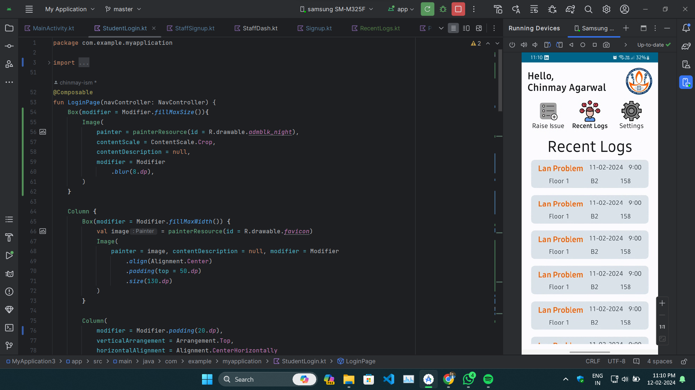
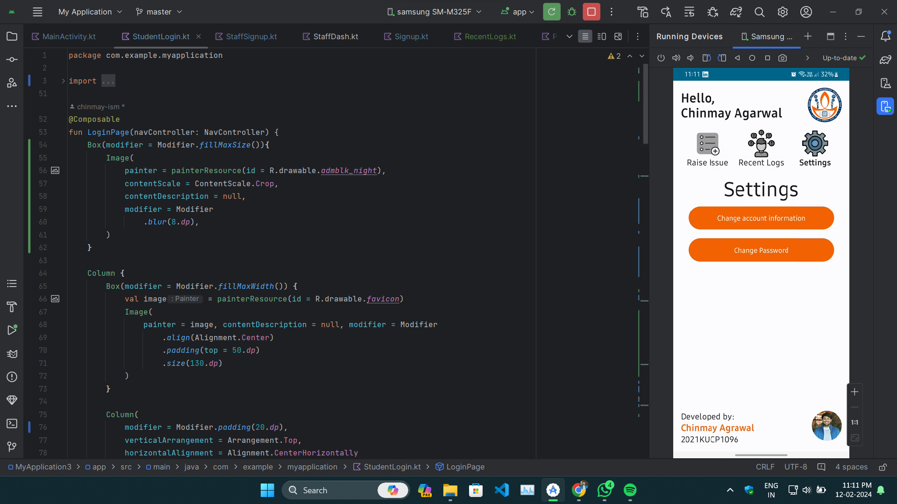

#IIIK-Hostel-Problem-APP

## Overview
This project is an Android application developed using Kotlin and Jetpack Compose to address the issues faced by students living in the IIIT Kota College hostel. It provides a systematic way for students to report various hostel-related problems. Additionally, it features a separate dashboard for staff members to address these reported issues efficiently.

## Features
- **Problem Reporting:** Students can report various hostel-related problems such as electricity issues, LAN connectivity problems, water supply disruptions, mess food quality, cleanliness concerns, plumbing issues, availability of drinking water, and miscellaneous problems.
- **Staff Dashboard:** Staff members have access to a dedicated dashboard where they can view and address the reported problems effectively.
- **Firebase Authentication:** Firebase is utilized for user authentication, ensuring secure access to the app's features.
- **Other Features:** The app may include additional features to enhance user experience and streamline the process of problem reporting and resolution.

## Technologies Used
- **Android Development:** The app is developed for the Android platform using Kotlin programming language.
- **Jetpack Compose:** Jetpack Compose is utilized for building the user interface, providing a modern and efficient way to design UI components.
- **Firebase:** Firebase is integrated into the app for user authentication purposes, ensuring secure access to the application.
- **Other Libraries:** Various other libraries and tools may be used to enhance the functionality and performance of the app.

## Usage
To use the IIIT Kota Hostel Problem Reporting App:
1. Download and install the app from the provided source.
2. Sign in using your credentials (for students and staff members).
3. Report any hostel-related problems encountered using the provided options.
4. Staff members can access the dashboard to view and address reported issues efficiently.

## Contributing
Contributions to the project are welcome! If you'd like to contribute, please follow these steps:
1. Fork the repository.
2. Create a new branch for your feature or bug fix.
3. Make your changes and ensure they are properly tested.
4. Submit a pull request detailing your changes for review.

## Contact
For any inquiries or support regarding the IIIT Kota Hostel Problem Reporting App, please ping me on linkedin.

   

        
    

   

        
    

   

        
    

    

        
    

   

        
    

   

        
    

